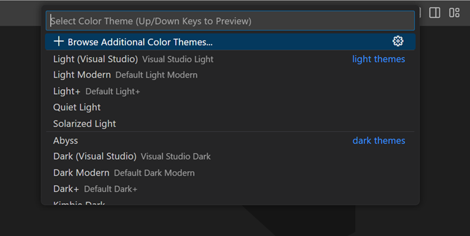
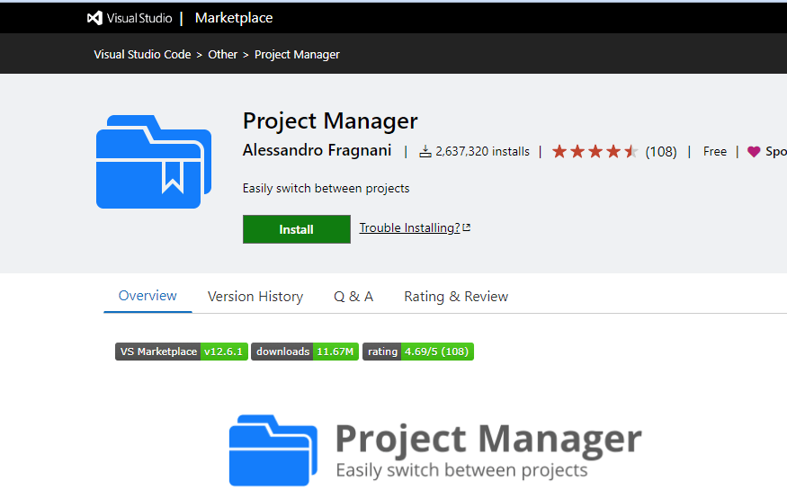

1. Installation of VS Code:
Here is a step-by-step guide to installing VS code on a Windows PC:
Step 1: Download The VS code Installer:
- Go to the official VSCode website [VS code Website](https://code.visualstudio.com/).
- Click on the "Download" button on the Navbar next to search bar.
- Select the Windows platform.
- Choose the installer (EXE) option.
- Save the installer to your computer (e.g..VSCodeSetup-x64.exe)

Step 2: Run The Installer:
- Locate the downloaded installer (VSCodeSetup-x64.exe) in your downloads folder.
- Double-click the installer to run it.
- Follow the prompts to begin the installation process.

Step 3: Choose The Installation Location:
- Select the installation location (e.g...C:\Program files\Microsoft VS Code).
- Choose whether to install VSCode for all users or just current user.
- Click "Next".

Step 4: Choose The Additional Tasks:
- Choose whether to:
    - Create a desktop shortcut.
    - Add VSCode to the PATH environment variable.
    - Install the VSCode Server for remote development.
- Click "Next".

Step 5: Start The Installation:
- Click "Install" to begin the installation process.
- Wait for the installation to complete.

Step 6: Launch VSCode:
- Click "Launch" to open VSCode for the first time.
- VSCode will prompt you to select a language and install any required extensions.

Step 7: Configure VSCode (Optional):
- Customize your VSCode settings, such as theme, font size, and extensions.
- Explore the various features and settings in the VSCode UI.

2. First-time Setup:
When VSCode is installed. You can configure VSCode to your liking through it's various settings.
VSCode provides different scopes of settings:
- User settings - Settings that apply globally to any instance of VS Code you open.
- Workspace settings - Settings stored inside your workspace and only apply when the workspace is opened.

Themes:
Color themes enable you to modify the colors in the Visual Studio Code user interface to match your preferences and work environment. A Color Theme affects both the VS Code user interface elements and the editor highlighting colors.

Color Themes from the Marketplace:
There are several out-of-the-box color themes in VS Code for you to try. Many more themes have been uploaded to the VS Code Extension Marketplace by the community.

You can select Color Themes from the VS Code Marketplace directly from the Color Theme picker by selecting Browse Additional Color Themes....

Alternately, you can search for themes in the Extensions view (Ctrl+Shift+X) search box by using the @category:"themes" filter.

Settings editor
Use the settings editor to review and change VS Code settings. To open the Settings editor navigate to File > Preferences > Settings or alternatively open the Settings editor from the Command Palette (Ctrl+Shift+P) with Preferences: Open Settings.

Changes to settings are applied directly by VS Code, as you change them. Modified settings are indicated with a blue line, similar to modified lines in the editor.

In the example below, the Side Bar location and File Icon Theme were changed.

Extension Settings:
Installed VS Code extensions can also contribute their own settings, which you can review under the Extensions section of the Settings editor.

You can also review an extension's settings from the Extensions view (Ctrl+Shift+X) by selecting the extension and reviewing the Feature Contributions tab.

Personally I use Flutter and you download it from the Extensions. If you want to install Flutter via Extension:
- Click on the extensions icon or Alternatively on you keyboard press (Ctrl+Shift+X)
- On the search bar where it says "Search Extensions" type Flutter.
- You should see on the results there is an extension of Flutter that is Verified by Dart Code.
- Click on it and click "Install".

Other Extensions you can add that are important are:
1. Auto Save

- Auto Save is a productivity booster feature in VS Code that frees you from manually saving the file. Instead, VS Code will automatically save the file for you if the option is enabled.

2. Live Server

- The Live Server extension enforces auto-reload and simplifies developers’ work by displaying the results of their code directly in the web browser without reloading the page. It spares developers the burden of constantly saving work in the editor and then reloading the browser to see changes. The Live Server extension has more than 2.4 million downloads.

3. Prettier

Prettier is one of the most popular VS Code extensions at the moment. It helps developers follow a standard style guide and maintain the same styles across the development team. With Prettier, you can quickly clean and format your code base to remove inconsistencies. More than 23 million developers have downloaded the VS Code Prettier extension so far.

4. Project Manager

The Project Manager is a useful extension for project managers to use to oversee several DevOps projects on VS Code at once. Regardless of where the projects are located, you can use the Project Manager extension to access them from a single computer. The Project Manager extension has more than 2.6 million downloads.

3. User Interface Overview:

VS Code comes with a simple and intuitive layout that maximizes the space provided for the editor, while leaving ample room to browse and access the full context of your folder or project. The user interface is divided into five main areas:
    - Activity bar: Located on the far left-hand side. Lets you switch between views and gives you additional context-specific indicators, like the number of outgoing changes when Git is enabled. You can change the position of the Activity Bar.
    - Primary Side Bar - Contains different views like the Explorer to assist you while working on your project.
    - Editor - The main area to edit your files. You can open as many editors as you like side by side vertically and horizontally.
    - Status Bar - Information about the opened project and the files you edit.

4. Command Palette:
The command palette provides access to many commands. You can run editor commands, open files, search for symbols, and see a quick outline of a file, all using the same interactive windows.
The command palette can be accessed by a combination keys which are Ctrl+Shift+P, which brings up the Command palette.
Here are some examples that command palette can perform:
    - Running commands: Execute various commands, such as debugging, testing, and tasks.
    - Opening files and folders: Quickly open specific files, folders, or projects.
    - Editing configurations: Modify settings, such as user settings, workspace settings, and keyboard shortcuts.
    - Searching and replacing: Perform searches, replacements, and regex operations.
    - Code actions: Trigger code actions like formatting, refactoring, and code snippets.
    - Debugging: Start, stop, and manage debugging sessions.
    - Testing: Run tests, view test results, and debug tests.

5. Extensions in VS Code:
VS Code extensions let you add languages, debuggers, and tools to your installation to support your development workflow.
To install extensions from VS Code. Bring up the Extensions view bu clicking on th Extensions icon in the Activity Bar on the side of VS code or the View: Extensions command (Ctrl+Shift+X)

This will show you a list of the most popular VS Code extensions on the VS Code Marketplace.

To install an extension, select the Install button. Once the installation is complete, the Install button will change to the Manage gear button.

VS Code makes it easy to manage your extensions. You can install, disable, update, and uninstall extensions through the Extensions view, the Command Palette (commands have the Extensions: prefix) or command-line switches.

Here are some examples of extensions used for web development:
    - ESLint
    - Beautify
    - Better Comments
    - Quokka
    - Polacode
    - Live Share
    - HTML CSS Support
    - Bracket Pair Colorizer

6. Integrated Terminal:
To begin, open VS Code on Windows 10/11 and navigate to the menu bar at the top. From there, select the "View" option and then click on "Terminal".
Using the Integrated Terminal in VS Code has several advantages over using an external terminal:
    - Convenience: Stay within the editor, no need to switch between windows or applications.
    - Context awareness: The terminal is aware of the current file, folder, or project, making it easier to execute commands.
    - Seamless debugging: Debugging is more streamlined, as you can run commands and debug simultaneously.
    - Improved workflow: Execute commands, run tests, and perform other tasks without leaving the editor.
    - Enhanced productivity: Reduce the need to switch between windows, making your workflow more efficient.
    - Better integration: The Integrated Terminal is tightly integrated with VS Code, allowing for features like automatic command suggestions and error detection.
    - Multi-root support: Easily work with multiple projects or folders in a single terminal.
    - Customization: Customize the terminal to your liking, with options like custom shells, themes, and more.

7. File and Folder Management:
How to create a file in VS Code:
- Open the Explorer: Click the Explorer icon in the left sidebar or press Ctrl+Shift+E (Windows/Linux) or Cmd+Shift+E (Mac).
- Click the "New File" button: In the Explorer, click the "New File" button (looks like a piece of paper with a plus sign) or right-click and select "New File".
- Name your file: Enter a name for your file, including the appropriate extension (e.g., .txt, .js, .py, etc.).
- Choose a location: Select the folder where you want to create the file.
- Create the file: Click the "Create" button or press Enter.
Alternatively, you can also:
- Press Ctrl+N (Windows/Linux) or Cmd+N (Mac) to create a new file.
- Right-click in the Explorer and select "New File" from the context menu.
Once you've created a new file, you can start editing it in the editor panel.

How to open a file in VS Code:
- Open the Explorer: Click the Explorer icon in the left sidebar or press Ctrl+Shift+E (Windows/Linux) or Cmd+Shift+E (Mac).
- Navigate to the file: In the Explorer, navigate to the folder containing the file you want to open.
- Click on the file: Click on the file to open it in the editor panel.
- Double-click: Alternatively, double-click the file to open it.
Or:
- Use the Command Palette: Press Ctrl+P (Windows/Linux) or Cmd+P (Mac) to open the Command Palette.
- Type the file name: Type the name of the file you want to open, and select it from the suggestions.
- Open the file: Press Enter to open the file in the editor panel.

How to manage files in VS Code by File Operations:
- Create file: Ctrl+N (Windows/Linux) or Cmd+N (Mac).
- Delete file: Del key or right-click > "Delete".
- Rename file: Click file name, or right-click > "Rename".
- Copy/Paste files: Ctrl+C / Ctrl+V (Windows/Linux) or Cmd+C / Cmd+V (Mac)

8. Settings and Preferences:
Where can users find and customize settings in VS Code?:
- Use the Settings editor to review and change VS Code settings. To open the Settings editor, navigate to File > Preferences > Settings. Alternately, open the Settings editor from the Command Palette (Ctrl+Shift+P) with Preferences: Open Settings or use the keyboard shortcut (Ctrl+,).

- When you open the Settings editor, you can search and discover the settings you are looking for. When you search using the search bar, it not only shows and highlights the settings matching your criteria, but also filter out those which are not matching. This makes finding settings quick and easy.

.png>)

Changes to settings are applied directly by VS Code, as you change them. Modified settings are indicated with a blue line, similar to modified lines in the editor.

In the example below, the Side Bar location and File Icon Theme were changed.

.png>)

Provide examples of how to change the theme, font size, and keybindings:
To select a different Color Theme:
    1. Select the File > Preferences > Theme > Color Theme menu item, or use the Preferences: Color Theme command (Ctrl+K Ctrl+T) to display the Color Theme picker.
    2. Use the Up and Down keys to navigate through the list and preview the colors of the theme.
    3. Select the theme you want and press Enter.

How To Change Font Size In VSCode:
    1. Open the settings (File > Preferences > Settings) or use the keyboard shortcut (Ctrl + ,)tThen type “font size” in the search box.
    2. You will see two options:
        - “editor.fontSize”: 18
        - “editor.lineHeight”: 24
    3. You can adjust these settings to your liking.
    4. If you want a bigger or smaller font size, simply change the numbers. The “lineHeight” option will adjust the spacing between lines.

9. Debugging in VS Code:
Outline the steps to set up and start debugging a simple program in VS Code:
Step 1: Create a new project
    - Open VS Code.
    - Create a new folder for your project.
    - Open the folder in VS Code.

Step 2: Create a simple program.
    - Create a new file (e.g., main.py or main.js).
    - Write a simple program (e.g., a "Hello World" program).

Step 3: Install a debugger extension.
    - Open the Extensions panel (Ctrl+Shift+X or Cmd+Shift+X).
    - Search for a debugger extension (e.g., "Python" or "JavaScript Debugger").
    - Install the extension.

Step 4: Configure the debugger.
    - Create a launch.json file (if prompted by the extension).
    - Configure the debugger settings (e.g., program path, runtime, etc.).

Step 5: Set breakpoints.
    - Open your program file.
    - Click in the gutter next to the line number where you want to set a breakpoint.
    - Press F9 or click the "Set Breakpoint" button.

Step 6: Start debugging.
    - Press F5 or click the "Start Debugging" button.
    - The debugger will start, and your program will run until it hits the breakpoint

Step 7: Debug your program.
    - Use the debugger tools (e.g., Step Over, Step Into, Step Out, etc.).
    - Inspect variables and expressions.
    - Fix errors and bugs.

Step 8: Stop debugging.
    - Press Shift+F5 or click the "Stop Debugging" button.
    - The debugger will stop, and your program will terminate.

What are some key debugging features available in VS Code:
VS Code offers a wide range of debugging features to help you identify and fix issues in your code. Here are some key debugging features available in VS Code:
    1. Breakpoints: Set breakpoints to pause code execution and inspect variables, expressions, and function calls.
    2. Step Over, Step Into, and Step Out: Control code execution to trace the flow of your program.
    3. Variable Inspection: Examine variable values, including objects and arrays, to understand the state of your program.
    4. Expression Evaluation: Evaluate expressions and see the results in real-time.
    5. Call Stack: View the call stack to see the sequence of function calls leading to the current point of execution.
    6. Debug Console: Interact with your program using the debug console, which allows you to execute code snippets and inspect variables.
    7. Watch: Set watches to monitor specific variables or expressions and see their values change in real-time.

10. Using Source Control:
How can users integrate Git with VS Code for version control:
- Make sure Git is installed on your computer, and you have a GitHub account.
- Open the Source Control view in VS Code.
- Select the Initialize Repository button to create a new Git repository in the current folder.
- Publish the local repository to GitHub by selecting the Publish to GitHub command button.
- Enter a name and description for the repository, and select whether to make it public or private.
- Open the GitHub repository in VS Code by selecting the Clone Repository button.
- Enter the repository URL, select Clone, and pick a folder on your local machine to clone the files into.
- Start tracking code changes by staging and committing your newly created and edited code by accessing the Source Control view from the Activity Bar.

Describe the process of initializing a repository, making commits, and pushing changes to GitHub:
- If your workspace is on your local machine, you can enable Git source control by creating a Git repository with the Initialize Repository command. When VS Code doesn't detect an existing Git repository, the Source Control view will give you the options to Initialize Repository or Publish to GitHub.

- You can also run the Git: Initialize Repository and Publish to GitHub commands from the Command Palette (Ctrl+Shift+P). Running Initialize Repository will create the necessary Git repository metadata files and show your workspace files as untracked changes ready to be staged. Publish to GitHub will directly publish your workspace folder to a GitHub repository, allowing you to choose between private and public repositories. Check out our publishing repos video for more information about publishing to GitHub

Make Commits:
    1. Make changes to your files, such as editing or adding new files.
    2. Open the Source Control view and select the changes you want to commit.
    3. Enter a commit message in the input field at the top of the Source Control view.
    4. Click the Commit button or press Ctrl+Enter (Windows/Linux) or Cmd+Enter (Mac) to commit the changes.

Push Changes to Github:
    1. Create a new repository on GitHub or link an existing one to your local repository.
    2. In the Source Control view, click the Push button or press Ctrl+Shift+P (Windows/Linux) or Cmd+Shift+P (Mac).
    3. Select the GitHub repository you want to push to and enter your credentials if prompted.
    4. VS Code will push your commits to the GitHub repository.
