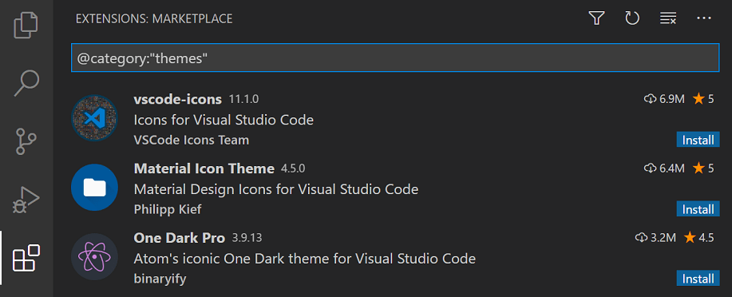
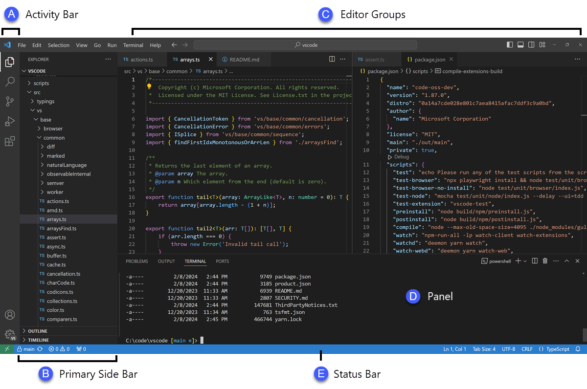

1. Installation of VS Code:
Here is a step-by-step guide to installing VS code on a Windows PC:
Step 1: Download The VS code Installer:
- Go to the official VSCode website [VS code Website](https://code.visualstudio.com/).
- Click on the "Download" button on the Navbar next to search bar.
- Select the Windows platform.
- Choose the installer (EXE) option.
- Save the installer to your computer (e.g..VSCodeSetup-x64.exe)

Step 2: Run The Installer:
- Locate the downloaded installer (VSCodeSetup-x64.exe) in your downloads folder.
- Double-click the installer to run it.
- Follow the prompts to begin the installation process.

Step 3: Choose The Installation Location:
- Select the installation location (e.g...C:\Program files\Microsoft VS Code).
- Choose whether to install VSCode for all users or just current user.
- Click "Next".

Step 4: Choose The Additional Tasks:
- Choose whether to:
    - Create a desktop shortcut.
    - Add VSCode to the PATH environment variable.
    - Install the VSCode Server for remote development.
- Click "Next".

Step 5: Start The Installation:
- Click "Install" to begin the installation process.
- Wait for the installation to complete.

Step 6: Launch VSCode:
- Click "Launch" to open VSCode for the first time.
- VSCode will prompt you to select a language and install any required extensions.

Step 7: Configure VSCode (Optional):
- Customize your VSCode settings, such as theme, font size, and extensions.
- Explore the various features and settings in the VSCode UI.

2. First-time Setup:
When VSCode is installed. You can configure VSCode to your liking through it's various settings.
VSCode provides different scopes of settings:
- User settings - Settings that apply globally to any instance of VS Code you open.
- Workspace settings - Settings stored inside your workspace and only apply when the workspace is opened.

Themes:
Color themes enable you to modify the colors in the Visual Studio Code user interface to match your preferences and work environment. A Color Theme affects both the VS Code user interface elements and the editor highlighting colors.

Color Themes from the Marketplace:
There are several out-of-the-box color themes in VS Code for you to try. Many more themes have been uploaded to the VS Code Extension Marketplace by the community.

You can select Color Themes from the VS Code Marketplace directly from the Color Theme picker by selecting Browse Additional Color Themes....

Alternately, you can search for themes in the Extensions view (Ctrl+Shift+X) search box by using the @category:"themes" filter.

Settings editor
Use the settings editor to review and change VS Code settings. To open the Settings editor navigate to File > Preferences > Settings or alternatively open the Settings editor from the Command Palette (Ctrl+Shift+P) with Preferences: Open Settings.

Changes to settings are applied directly by VS Code, as you change them. Modified settings are indicated with a blue line, similar to modified lines in the editor.

In the example below, the Side Bar location and File Icon Theme were changed.

Extension Settings:
Installed VS Code extensions can also contribute their own settings, which you can review under the Extensions section of the Settings editor.

You can also review an extension's settings from the Extensions view (Ctrl+Shift+X) by selecting the extension and reviewing the Feature Contributions tab.

Personally I use Flutter and you download it from the Extensions. If you want to install Flutter via Extension:
- Click on the extensions icon or Alternatively on you keyboard press (Ctrl+Shift+X)
- On the search bar where it says "Search Extensions" type Flutter.
- You should see on the results there is an extension of Flutter that is Verified by Dart Code.
- Click on it and click "Install".

Other Extensions you can add that are important are:
1. Auto Save

- Auto Save is a productivity booster feature in VS Code that frees you from manually saving the file. Instead, VS Code will automatically save the file for you if the option is enabled.

2. Live Server

- The Live Server extension enforces auto-reload and simplifies developers’ work by displaying the results of their code directly in the web browser without reloading the page. It spares developers the burden of constantly saving work in the editor and then reloading the browser to see changes. The Live Server extension has more than 2.4 million downloads.

3. Prettier

Prettier is one of the most popular VS Code extensions at the moment. It helps developers follow a standard style guide and maintain the same styles across the development team. With Prettier, you can quickly clean and format your code base to remove inconsistencies. More than 23 million developers have downloaded the VS Code Prettier extension so far.

4. Project Manager

The Project Manager is a useful extension for project managers to use to oversee several DevOps projects on VS Code at once. Regardless of where the projects are located, you can use the Project Manager extension to access them from a single computer. The Project Manager extension has more than 2.6 million downloads.

3. User Interface Overview:

VS Code comes with a simple and intuitive layout that maximizes the space provided for the editor, while leaving ample room to browse and access the full context of your folder or project. The user interface is divided into five main areas:
    - Activity bar: Located on the far left-hand side. Lets you switch between views and gives you additional context-specific indicators, like the number of outgoing changes when Git is enabled. You can change the position of the Activity Bar.
    - Primary Side Bar - Contains different views like the Explorer to assist you while working on your project.
    - Editor - The main area to edit your files. You can open as many editors as you like side by side vertically and horizontally.
    - Status Bar - Information about the opened project and the files you edit.

4. Command Palette:
The command palette provides access to many commands. You can run editor commands, open files, search for symbols, and see a quick outline of a file, all using the same interactive windows.
The command palette can be accessed by a combination keys which are Ctrl+Shift+P, which brings up the Command palette.
Here are some examples that command palette can perform:
    - Running commands: Execute various commands, such as debugging, testing, and tasks.
    - Opening files and folders: Quickly open specific files, folders, or projects.
    - Editing configurations: Modify settings, such as user settings, workspace settings, and keyboard shortcuts.
    - Searching and replacing: Perform searches, replacements, and regex operations.
    - Code actions: Trigger code actions like formatting, refactoring, and code snippets.
    - Debugging: Start, stop, and manage debugging sessions.
    - Testing: Run tests, view test results, and debug tests.

5. Extensions in VS Code:
VS Code extensions let you add languages, debuggers, and tools to your installation to support your development workflow.
To install extensions from VS Code. Bring up the Extensions view bu clicking on th Extensions icon in the Activity Bar on the side of VS code or the View: Extensions command (Ctrl+Shift+X)

This will show you a list of the most popular VS Code extensions on the VS Code Marketplace.

To install an extension, select the Install button. Once the installation is complete, the Install button will change to the Manage gear button.

VS Code makes it easy to manage your extensions. You can install, disable, update, and uninstall extensions through the Extensions view, the Command Palette (commands have the Extensions: prefix) or command-line switches.

Here are some examples of extensions used for web development:
    - ESLint
    - Beautify
    - Better Comments
    - Quokka
    - Polacode
    - Live Share
    - HTML CSS Support
    - Bracket Pair Colorizer

6. Integrated Terminal:
To begin, open VS Code on Windows 10/11 and navigate to the menu bar at the top. From there, select the "View" option and then click on "Terminal".
Using the Integrated Terminal in VS Code has several advantages over using an external terminal:
    - Convenience: Stay within the editor, no need to switch between windows or applications.
    - Context awareness: The terminal is aware of the current file, folder, or project, making it easier to execute commands.
    - Seamless debugging: Debugging is more streamlined, as you can run commands and debug simultaneously.
    - Improved workflow: Execute commands, run tests, and perform other tasks without leaving the editor.
    - Enhanced productivity: Reduce the need to switch between windows, making your workflow more efficient.
    - Better integration: The Integrated Terminal is tightly integrated with VS Code, allowing for features like automatic command suggestions and error detection.
    - Multi-root support: Easily work with multiple projects or folders in a single terminal.
    - Customization: Customize the terminal to your liking, with options like custom shells, themes, and more.

